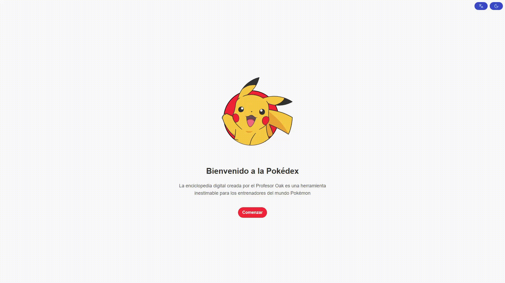

# Pokédex: Prueba Técnica para Desarrollador Frontend

> [!IMPORTANT]  
> Es crucial leer toda la información de este documento para comprender la solución implementada.

[Live Demo](https://global66-test-code.vercel.app/welcome)



## Descripción del Proyecto

Este proyecto es una implementación de una Pokédex, desarrollada como **prueba técnica para la postulación al cargo de Desarrollador Frontend** en la tribu [Global66](https://global66.com/cl/).

### Enfoque y Metodología

Para su desarrollo, se realizó un **análisis exhaustivo de los requisitos** solicitados en el test, garantizando una **implementación efectiva, completa y optimizada** que satisface todas las necesidades planteadas.

#### Tecnologias utilizadas

En esta sección se detallan las tecnologías utilizadas y su porque:

* **TypeScript**: Añade tipado estático al código JavaScript, mejorando la mantenibilidad y reduciendo errores en tiempo de desarrollo.

* **Pinia**: Librería de gestión de estado recomendada para Vue 3, utilizada para manejar el estado global de los pokemons favoritos y la UI.

* **Vue Router**: Permite la navegación entre diferentes vistas de la aplicación de forma declarativa y reactiva.

* **Vue I18n**: Solución de internacionalización para Vue, utilizada para soportar múltiples idiomas en la interfaz.

* **Axios**: Cliente HTTP utilizado para realizar peticiones a la API de Pokémon.

* **@tanstack/vue-query**: Maneja el fetching, caching y sincronización de datos remotos (API de Pokémon), facilitando la gestión de estados de carga y error.

* **Tailwind CSS**: Framework de utilidades CSS para diseñar interfaces modernas y responsivas de manera rápida y eficiente.

* **Vitest**: Framework de testing rápido y moderno, utilizado para pruebas unitarias y de integración en el proyecto.

* **@vue/test-utils**: Utilidad oficial para testear componentes Vue de manera sencilla y efectiva.

* **Playwright**: Herramienta para pruebas end-to-end, asegurando que los flujos críticos de la aplicación funcionen correctamente en diferentes navegadores.

* **normalize.css**: Hoja de estilos para normalizar el renderizado de los elementos HTML en los diferentes navegadores.

* **vue-virtual-scroller**: Permite renderizar listas largas de manera eficiente, mejorando el rendimiento y la experiencia de usuario.

> [!IMPORTANT]  
> Decidí no usar una libreria de componentes para tener la mayor flexibilidad en el diseño.

### Desafíos enfrentados

#### **Implementación del Buscador**

En la implementación del buscador, me encontré con un desafío clave: la API de Pokémon **no provee un parámetro para la búsqueda parcial de nombres de Pokémon**. Esta limitación inicial me llevó a plantearme una pregunta fundamental: ¿Cómo podría implementar un buscador que sea realmente útil y eficiente para el usuario, especialmente bajo la condición explícita de la prueba técnica: "**_buscamos que pienses en gran cantidad de data_**"?

Tras analizar diversas aproximaciones y sopesar sus implicaciones, tanto en rendimiento como en experiencia de usuario, me decanté por una solución óptima para este escenario. A continuación, presento las diferentes ideas consideradas para la implementación del buscador, incluyendo sus pros y contras:

1. **Traer todos los datos (Solución 100% Frontend)**:
    * **Descripción**: La primera idea consistió en implementar una solución de búsqueda completamente en el frontend, lo que implicaría **traer todos los datos de los Pokémon de inmediato al cargar la aplicación**.
    * **Análisis y Decisión**: Esta opción fue rápidamente descartada. Si bien es sencilla de implementar para un conjunto de datos pequeño, al considerar el supuesto de que existen muchos más Pokémon de los 1025 actuales (pensando en "gran cantidad de data"), traer toda la información de golpe sin ningún tipo de paginación o filtrado inicial es una **muy mala práctica** que impactaría severamente el rendimiento, los tiempos de carga y la experiencia del usuario (especialmente en dispositivos móviles o conexiones lentas). Los costos de red y procesamiento serían inaceptables para una aplicación escalable.

2. **Búsqueda por nombre exacto (Integrando la API)**:
    * **Descripción**: Esta idea propone utilizar la API de Pokémon para realizar búsquedas, pero solo si el usuario introduce el **nombre exacto** del Pokémon. La API permite buscar por nombre o ID, lo cual sería directo.
    * **Análisis y Decisión**: Si bien esta es la forma más eficiente de interactuar con la API (peticiones directas y ligeras), presenta una **severa limitación en la usabilidad**. Exigir al usuario que conozca el nombre exacto de cada Pokémon frustraría la experiencia, ya que un buscador suele implicar sugerencias o autocompletado. No responde a la necesidad de "descubrimiento" que una Pokédex debería ofrecer. Fue considerada insuficiente por sí sola.

3. **Búsqueda parcial de los datos paginados (Frontend + Paginación)**:
    * **Descripción**: Esta aproximación consiste en **paginar la carga inicial de los Pokémon** y, para la búsqueda parcial, solo realizar la búsqueda sobre los datos que ya están cargados en el frontend (es decir, los de la página actual o las pocas páginas cercanas).
    * **Análisis y Decisión**: Esta solución mejora la carga inicial al no traer todos los datos de una vez. Sin embargo, para una **búsqueda parcial real y completa**, sería **inefectiva**. Si un Pokémon no está en las páginas actualmente cargadas, el usuario no lo encontraría. Esto obligaría a un mecanismo complejo de "cargar más páginas y buscar de nuevo", lo cual es confuso y poco intuitivo, especialmente cuando se busca en una "gran cantidad de data" donde un Pokémon podría estar en la página 500. No garantiza que el usuario encuentre lo que busca sin múltiples interacciones.

4. **Combinación de Búsqueda por Nombre Exacto y Filtrado en Frontend de un Conjunto Inicial (La Solución Elegida)**:
    * **Descripción**: Esta es la estrategia adoptada. Se basa en una combinación inteligente para ofrecer la mejor experiencia posible bajo las restricciones de la API y la condición de "gran cantidad de data".
        * **Carga Inicial Optimizada**: Se **paginan los datos al cargar la aplicación**, trayendo solo un número manejable de Pokémon inicialmente. Esto garantiza un arranque rápido.
        * **Búsqueda Exacta Directa a la API**: Si el usuario introduce un nombre completo y exacto, se realiza una **petición directa a la API** para obtener ese Pokémon específico. Esta es la vía más rápida y eficiente para búsquedas precisas.
        * **Búsqueda Parcial con Autocompletado/Filtrado en Frontend**: Para la búsqueda parcial, en lugar de intentar traer todos los datos, se implementó un **filtrado sobre un conjunto de nombres paginados**.

    * **Justificación de la Elección**: Esta combinación ofrece un **balance óptimo entre rendimiento y usabilidad**.
        * Evita la carga masiva inicial (punto 1).
        * Proporciona resultados inmediatos para búsquedas exactas (punto 2).
        * Permite la búsqueda parcial.

> [!IMPORTANT]
> La **solución ideal** para una búsqueda eficiente y escalable residiría en que la API de Pokémon ofreciera un parámetro que permitiera **búsquedas por coincidencias parciales de nombres**.

#### **Implementación de Pokémons favoritos**

La funcionalidad de "Pokémons favoritos" es una característica clave para personalizar la experiencia del usuario, permitiéndole guardar y acceder rápidamente a sus Pokémon preferidos. Su implementación se diseñó buscando eficiencia y persistencia de datos.

**Enfoque y Gestión del Estado:**

Para gestionar el estado de los Pokémon marcados como favoritos, se utilizó **Pinia**, la solución de gestión de estado recomendada para Vue 3. Pinia permitió crear un _store_ dedicado exclusivamente a los favoritos, facilitando:

* **Centralización**: Un único lugar para la lógica y el estado de los favoritos.
* **Reactividad**: Cualquier cambio en el listado de favoritos se refleja automáticamente en la interfaz de usuario.
* **Persistencia**: Mediante la integración de `localStorage` (o una librería que lo maneje), se asegura que la lista de favoritos se mantenga incluso después de que el usuario cierre y vuelva a abrir la aplicación o el navegador. Esto es crucial para una experiencia de usuario consistente.

**Funcionalidades Clave:**

* **Añadir/Eliminar de favoritos**: Interacción sencilla desde la vista de detalle de cada Pokémon o desde las tarjetas del listado principal.
* **Visualización de favoritos**: Una sección dedicada que muestra solo los Pokémon que el usuario ha guardado.
* **Manejo de duplicados**: Lógica implementada para evitar que un mismo Pokémon sea añadido múltiples veces a la lista.

## Configuración del proyecto

### Instalar dependencias

```sh
npm install
```

### Compilar

```sh
npm run dev
```

### Comprobación tipográfica, compilación y minimización para producción

```sh
npm run build
```

### Ejecutar pruebas unitarias con [Vitest](https://vitest.dev/)

```sh
npm run test:unit
```

### Ejecutar pruebas de extremo a extremo con [Playwright](https://playwright.dev)

```sh
# Instalar navegadores para la primera ejecución
npx playwright install

# Cuando se realizan pruebas en CI, primero se debe compilar el proyecto
npm run build

# Ejecuta las pruebas de extremo a extremo
npm run test:e2e

# Ejecuta las pruebas en modo depuración
npm run test:e2e -- --debug
```

### Lint con [ESLint](https://eslint.org/)

```sh
npm run lint
```
